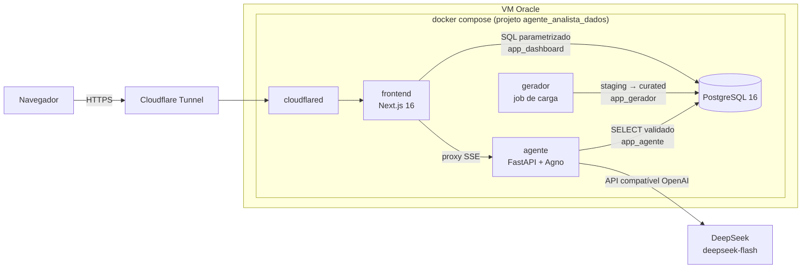
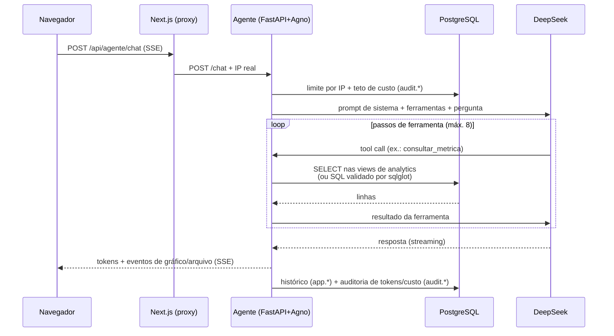
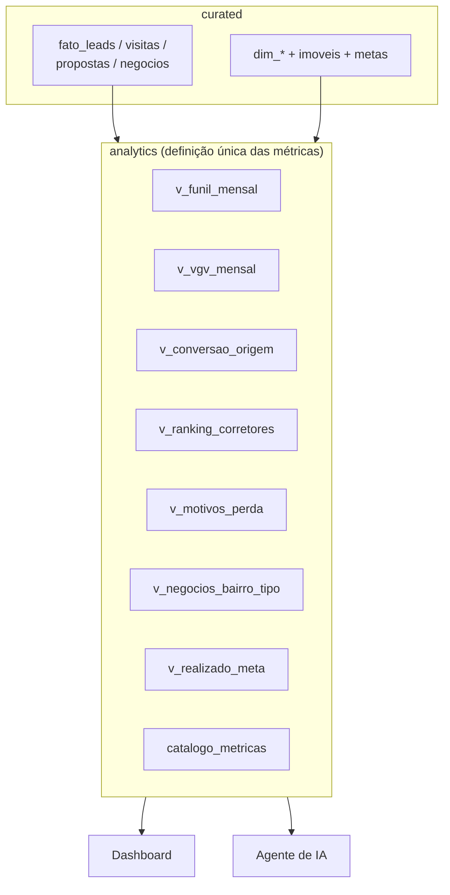

# Agente Analista de Dados — Serra Clara Imóveis

Aplicação web de portfólio com duas abas — **Dashboard** e **Agente de IA** —
sobre um banco PostgreSQL com **dados 100% fictícios** de uma imobiliária
regional. O agente responde perguntas em português consultando o banco (nunca
inventa números), gera gráficos dentro do chat e produz relatórios em PDF e
planilhas Excel para download.

> ⚠️ Nenhum dado é real: pessoas, CPFs, telefones, endereços, cidades e bairros
> são todos gerados (ver `dados/gerar_dados.py`). "Serra Clara Imóveis" é um
> nome fictício — a sugestão original "Lumina Imóveis" foi descartada por ter
> homônimos reais.

---

## 1. O problema que o projeto resolve

Imobiliárias regionais têm dados comerciais espalhados e pouca capacidade de
análise: o funil (lead → visita → proposta → negócio) fica invisível, metas
não são acompanhadas e gestores não conseguem perguntar "por que caímos em
janeiro?" sem um analista. Este projeto demonstra, de ponta a ponta, como um
**Engenheiro de IA** resolve isso: camada semântica única no banco, dashboard
de BI e um agente de IA com ferramentas seguras que responde em linguagem
natural — ambos lendo **as mesmas views**, para nunca divergirem.

## 2. Demonstração

- URL pública: `https://agenteanalistadedados.projetostechmauricio.lol`

https://github.com/user-attachments/assets/5645e606-f90b-4779-95ef-5e4929c468d6

## 3. Funcionalidades

**Dashboard**
- Filtros: período (padrão: últimos 12 meses), cidade, finalidade, tipo de
  imóvel, origem do lead e equipe/corretor.
- 9 cartões de indicadores com variação sobre o período anterior: leads,
  visitas, propostas, negócios fechados, VGV, receita de comissões, ticket
  médio, taxa de conversão e tempo médio de fechamento.
- 7 gráficos (Apache ECharts): funil, VGV × negócios por mês, leads e conversão
  por origem, ranking de corretores, negócios por bairro e por tipo, Pareto de
  motivos de perda e realizado × meta por equipe.
- Tabela dos últimos negócios, paginada e exportável para Excel.
- Rodapé com "Dados atualizados em …" (lido de `audit.cargas`).
- Estados de carregamento, vazio e erro; layout responsivo.

**Agente de IA**
- Chat com histórico (navegador + banco, por sessão anônima), resposta em
  streaming (SSE), gráficos desenhados dentro do chat e links de download para
  PDFs e planilhas gerados (válidos por 24 h).
- **Relatórios em PDF com análise:** o agente consulta os dados, escreve o
  resumo executivo e as conclusões, e o servidor monta o PDF com esse texto e
  uma seção (tabela completa + gráfico) para cada consulta usada. O modelo
  passa só o `resultado_id` das consultas — os números das tabelas e gráficos
  vêm direto do banco, nunca redigitados pelo modelo.
- Sugestões de perguntas prontas para clicar.

## 4. Arquitetura

### Visão geral



### Fluxo de uma pergunta ao agente



### Camada semântica



## 5. Estrutura de pastas

```
├── banco/migrations/      # 000-006: usuários, schemas, tabelas, views, permissões
├── dados/                 # gerar_dados.py (Faker pt_BR, semente fixa) + Dockerfile
├── agente/                # serviço FastAPI + Agno
│   ├── app/               # main (SSE), ferramentas, seguranca (sqlglot),
│   │                      # limites, relatorios (PDF/Excel), db, agente
│   ├── avaliacao/         # perguntas.yaml (25) + avaliar.py
│   └── tests/             # segurança (ataques SQL), banco (coerência/reconciliação)
│                          # e regressões (PDF, filtros, isolamento)
├── frontend/              # Next.js App Router + Tailwind + shadcn/ui + ECharts
│   ├── app/               # página Dashboard, página Agente, route handlers /api/*
│   ├── components/        # filtros, cartões, gráficos, tabela, chat
│   └── lib/               # pool pg, filtros/where parametrizado, formatadores
├── scripts/               # backup.sh (pg_dump, retenção 14 dias) + timer systemd
└── docker-compose.yml     # db + gerador + agente + frontend + tunnel
```

## 6. Stack tecnológica

| Camada | Escolha | Por quê |
|---|---|---|
| Banco | PostgreSQL 16 (Docker) | Views SQL como camada semântica; roles por serviço |
| Frontend | Next.js 16 (App Router) + TS + Tailwind v4 + shadcn/ui + ECharts + TanStack Query | Route handlers com SQL parametrizado (`pg`); UI consistente |
| Agente | Python 3.12 + FastAPI + **Agno 3** | Ver justificativa abaixo |
| Modelo | DeepSeek `deepseek-flash` (API compatível com OpenAI) | Custo baixo, tool calling, português bom |
| Relatórios | ReportLab + matplotlib (PDF), openpyxl (Excel) | WeasyPrint exigiria pango/cairo e estouraria o limite de 384 MB do container |
| Validação SQL | sqlglot | Parse real de SQL (não regex) |
| Infra | Docker Compose + Cloudflare Tunnel | VM compartilhada; zero portas públicas |

**Por que Agno (e não LangGraph)?** Nos meus outros projetos uso LangGraph,
que é excelente para fluxos agentic com estado explícito e grafos de decisão
complexos. Aqui o agente é um loop simples de "pergunta → ferramentas →
resposta": o Agno entrega exatamente isso com muito menos código — tools são
funções Python comuns com docstring, streaming e tool_call_limit vêm prontos,
e a dependência é leve (cabe nos 384 MB do container). LangGraph faria sentido
se o agente precisasse de planejamento multi-etapas com estado persistente ou
ciclos human-in-the-loop; para um analista de dados com 7 ferramentas, o Agno
é mais simples de ler, testar e manter — e simplicidade é um requisito deste
projeto. (Adaptação feita: o Agno 3 traduz o papel `system` para `developer`,
que a API da DeepSeek rejeita; corrigido com `role_map` em `agente/app/agente.py`.)

## 7. Como rodar

### Localmente (Docker)

```bash
cp .env.exemplo .env   # preencha as senhas e a DEEPSEEK_API_KEY
docker compose up -d --build
```

Na primeira subida o Postgres aplica as migrações e o serviço `gerador` carga
os dados fictícios (só se o banco estiver vazio); o agente espera a carga
terminar. Para recriar os dados: `docker compose run --rm gerador python gerar_dados.py`.

- Dashboard: `http://127.0.0.1:13000`
- Agente (API): `http://127.0.0.1:18100/saude`

### Na VM Oracle

O deploy segue as regras da VM compartilhada: pasta
`~/Projetos_GitHub_Dados_IA/Projetos_Vagas_Engenheiro_IA/Agente_Analista_Dados`,
portas só em `127.0.0.1` (13000 e 18100), limites de memória em todos os
serviços (projeto inteiro < ~1 GB) e publicação via Cloudflare Tunnel
(profile `publica`, token só no `.env`).

```bash
cd ~/Projetos_GitHub_Dados_IA/Projetos_Vagas_Engenheiro_IA/Agente_Analista_Dados
docker compose up -d --build
# TUNNEL_TOKEN preenchido no .env da VM (nunca no repositório)
docker compose --profile publica up -d tunnel
```

### Backup

`scripts/backup.sh`: `pg_dump -Fc` para `~/backups/agente_analista_dados/`,
retenção de 14 dias. `scripts/instalar_backup.sh` agenda a execução diária
(03:17, horário de Brasília) com um timer systemd próprio do projeto.

### Testes

```bash
docker compose exec agente python -m pytest tests/ -q   # segurança + banco
cd frontend && npm run lint && npm run build            # lint + build TS
```

## 8. Catálogo de métricas

Definidas uma única vez nas views de `analytics` e documentadas em
`analytics.catalogo_metricas` (consultável pela ferramenta
`listar_metricas_e_dimensoes`):

| Métrica | Definição | Fonte |
|---|---|---|
| Leads recebidos | `SUM(leads)` | v_funil_mensal |
| Visitas realizadas | visitas com comparecimento | v_funil_mensal |
| Propostas enviadas | `SUM(propostas)` | v_funil_mensal |
| Negócios fechados | status `fechado` | v_funil_mensal |
| VGV | soma de `valor_negocio` das **vendas** fechadas | v_vgv_mensal |
| Receita de comissões | soma de `valor_comissao` | v_vgv_mensal |
| Ticket médio | VGV ÷ nº de vendas fechadas | v_vgv_mensal |
| Taxa de conversão | fechados ÷ leads no mesmo recorte | v_funil_mensal |
| Tempo médio de fechamento | média de dias abertura → fechamento | v_vgv_mensal |
| Funil | leads/visitas/propostas/fechados/perdidos | v_funil_mensal |
| Conversão por origem | fechados ÷ leads por origem | v_conversao_origem |
| Ranking de corretores | negócios, VGV e comissões por corretor | v_ranking_corretores |
| Motivos de perda | perdidos por motivo | v_motivos_perda |
| Negócios por bairro/tipo | fechados e VGV por bairro e tipo | v_negocios_bairro_tipo |
| Realizado × meta | realizado ÷ meta mensal por equipe | v_realizado_meta |

Convenção: em locação, `valor_negocio` = 12 × aluguel (valor anual do contrato).

## 9. Avaliação do agente

`agente/avaliacao/perguntas.yaml` tem **25 perguntas** com gabarito calculado
por SQL direto no momento da avaliação (perguntas com período relativo ficam
sempre corretas). `avaliar.py` mede acerto, tempo e custo:

```bash
docker compose exec agente python avaliacao/avaliar.py
```

**Resultado (28/09/2026, VM Oracle, modelo `deepseek-flash`):**

| Rodada | Acerto | Custo total | Tempo médio |
|---|---|---|---|
| 1 | 24/25 (96%) | US$ 0,14 | 5,3 s |
| 2 (final) | **25/25 (100%)** | US$ 0,15 | 5,3 s |

Meta: ≥ 85% — **atingida**. Na rodada 1, a única falha (q25, "previsão do
tempo") foi uma recusa correta que o avaliador marcou como erro porque a
resposta sugeria "últimos 90 dias" (o checador de recusa não aceita números
acima de 31, para pegar dados inventados). O critério **não** foi afrouxado.

Cobertura: 20 perguntas numéricas/de ranking (gabarito por SQL direto),
2 de artefato (PDF e Excel gerados de fato) e 3 de recusa (CPF de clientes,
pedido de DELETE e assunto fora do escopo). Detalhes por pergunta em
`agente/avaliacao/resultado_avaliacao.json`.

## 10. Segurança

A aplicação **não tem login** (decisão de escopo), então a segurança é travada
em código:

- **Limites de uso do agente:** 20 perguntas/hora por IP (`audit.limite_ip`),
  máximo de 8 passos de ferramenta por pergunta (`tool_call_limit`), timeout
  de 10 s por SQL e **teto diário de custo** na DeepSeek que desliga o chat
  com mensagem amigável.
- **Menor privilégio no banco:** 3 usuários — `app_dashboard` (SELECT),
  `app_agente` (SELECT + INSERT só em app.*/audit.*) e `app_gerador` (carga).
  Todos com `default_transaction_read_only = on` e `statement_timeout = 10s`.
  `curated.clientes` não tem GRANT para dashboard nem agente.
- **Validação sqlglot** antes de qualquer SQL livre: um único comando, apenas
  SELECT, sem funções perigosas (`pg_sleep`, `pg_read_file`, `dblink`, `copy`…),
  só tabelas da lista branca, colunas sensíveis bloqueadas e LIMIT automático
  de 1.000. Prova: `agente/tests/test_seguranca.py` (14 testes de ataque).
- **SQL do Dashboard sempre parametrizado** (`lib/filtros.ts` monta o WHERE
  com lista fechada de colunas e valores `$n`).
- **Arquivos gerados** com nome aleatório (uuid), apagados após 24 h.
- **Segredos** só em `.env` (nunca versionado); `.env.exemplo` com exemplos.
- **Banco nunca exposto**: portas em `127.0.0.1`, acesso web só pelo túnel.
